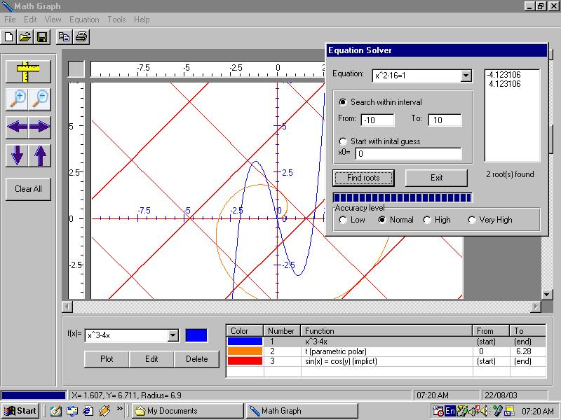



## \[Math Graph\] : Advanced equation plotter/solver \(\*\*UPDATE: VERSION: 1\.2\.0\*\*\*\)

### Description

Math Graph is an advanced program that graphs and solves equations plus many other calculations(area under curve, slope at any point,...), it supports most types of graph(normal, parametric, polar, implict)and also supports many functions, it has a powerful equation solver that solves almost any single variable equation, it has the ability to open and save files and print the graph on a sheet of paper.

Version 1.2.0 includes calculating extrema and inflexion points, drawing tangents, and some minor improvments and bug fixes.
 
### More Info
 

             |
---                |---
**Submitted On**   |2003-10-09 00:53:46
**By**             |[sohaib farsakh](https://github.com/Planet-Source-Code/PSCIndex/blob/master/ByAuthor/sohaib-farsakh.md)
**Level**          |Advanced
**User Rating**    |4.9 (137 globes from 28 users)
**Compatibility**  |VB 6\.0
**Category**       |[Math/ Dates](https://github.com/Planet-Source-Code/PSCIndex/blob/master/ByCategory/math-dates__1-37.md)
**World**          |[Visual Basic](https://github.com/Planet-Source-Code/PSCIndex/blob/master/ByWorld/visual-basic.md)
**Archive File**   |[\[Math\_Grap18194511182004\.zip](https://github.com/Planet-Source-Code/sohaib-farsakh-math-graph-advanced-equation-plotter-solver-update-version-1-2-0__1-54955/archive/master.zip)

